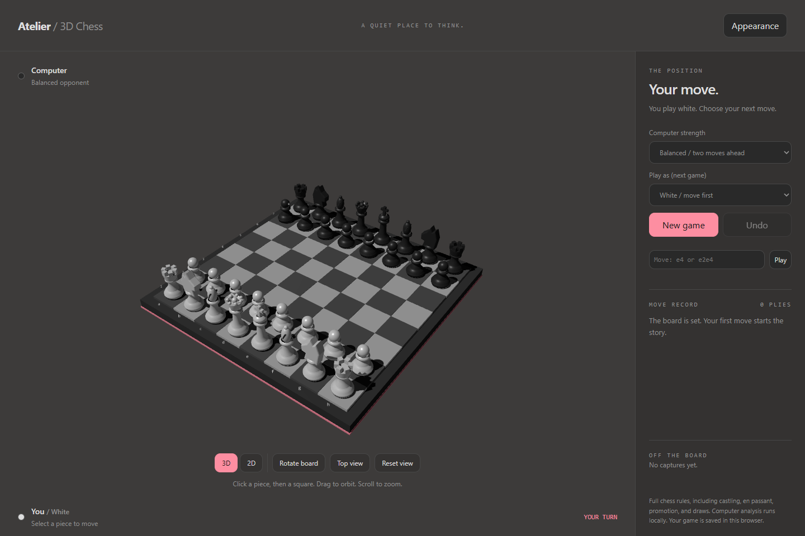
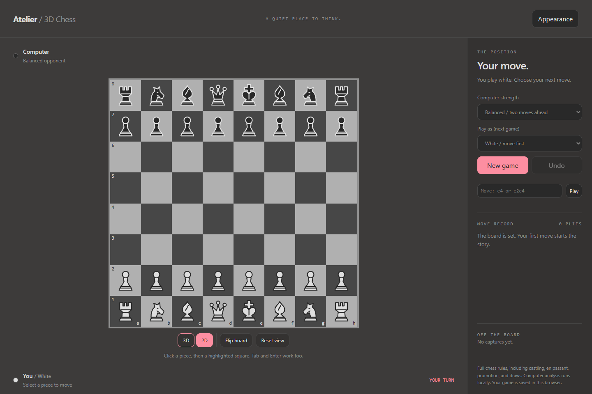

# chess3dastra

A fully playable 3D (and 2D) chess game against a local computer opponent — built end-to-end in the [GitHub Copilot app](https://github.com/features/copilot) as a hands-on test of **GPT‑6‑Astra**.

**▶ Play it live:** https://yortch.github.io/chess3dastra/ *(GitHub Pages, static, no server)*

| 3D — dark | 2D — dark |
| --- | --- |
|  |  |

Full chess rules (castling, en passant, promotion, draws), three computer difficulty levels, click-or-keyboard moves, algebraic notation entry, undo, move history, captures list, light/dark themes, and a saved game that survives a reload — all in one self-contained `index.html`.

---

## The experiment

This repo exists to document a real, unscripted session testing **GPT‑6‑Astra** on a non-trivial, self-contained build task: a 3D game with an AI opponent, built from a single one-line prompt, then iterated on — all inside the [GitHub Copilot app](https://github.com/features/copilot).

### Prompts used, verbatim, in order

1. `Build a 3D Chess that I can play against computer`
2. `looks great, add a 2D view`
3. `/rubber-duck implementation` — requested an independent critique of the implementation from a second agent
4. `Implement all 3 suggestions` — asked the model to act on the rubber-duck agent's findings

No other steering, code review, or corrections were given between these prompts — each response was accepted before the next prompt was sent.

### What it produced

From prompt 1 alone, the model:
- Chose a stack (vanilla JS + [Three.js](https://threejs.org/) for rendering, [chess.js](https://github.com/jhlywa/chess.js) for authoritative rules) without being told what to use
- Modeled every piece as hand-built 3D geometry (lathes/extrusions), not sprites or an external model
- Implemented a computer opponent from scratch: iterative-deepening negamax with alpha-beta pruning, move ordering by capture value, running off the UI thread in a Web Worker, with three selectable strengths
- Wired up full game lifecycle: promotion dialog, undo, move history/captures panel, light/dark themes, mobile-responsive layout, and `localStorage` save/restore
- Wrote and ran its own automated checks: a Node test suite for chess rules/engine correctness, and Playwright browser tests (mouse, keyboard, mobile viewport, theme toggling) against a real headless browser — without being asked to

From prompt 2, it added a second, independent 2D rendering path (a DOM grid of accessible `<button>` squares with inline SVG pieces) sharing the same game state and move pipeline as the 3D view, plus a view toggle that persists across reloads — again validated with new Playwright coverage before it was shown as done.

### Review findings (rubber-duck pass)

Prompt 3 asked a second, independent agent to critique the implementation with no other context than the source files. It read the code (not just took the first agent's word for it) and returned three demonstrated, reproducible findings:

| Severity | Finding | Where |
| --- | --- | --- |
| Medium | If WebGL fails to initialize, the *entire* board area — including the independent 2D view — was destroyed at startup, so a "no 3D" fallback still left the user with no playable board at all. | `app.js` renderer init |
| Low | Submitting a move via the notation input dropped keyboard focus after the computer replied, breaking rapid keyboard-only play. | `app.js` move submission / focus handling |
| Low | The promotion and "new game" `<dialog>` elements had no accessible name for screen readers. | `index.html` dialogs |

Prompt 4 asked the model to fix all three. It did, then wrote three new dedicated Playwright suites (no-WebGL simulation via canvas-context patching, keyboard-focus regression scenarios, and dialog accessible-name assertions) and re-ran the full existing test suite to confirm nothing regressed, before reporting completion.

### What held up well
- Clean separation between game rules (`chess.js`, authoritative), search (`search.js`, pure/stateless), and rendering (two independent, swappable views over one shared game state) — this made the 2D view and later fixes low-risk to add
- It reached for real automated testing by default (unit + headless browser), not just visual self-review
- It treated the rubber-duck findings as real bugs to fix with regression tests, not just prose acknowledgment

### Possible improvements (not implemented — ideas for a next pass)
- **Opening book / stronger engine** — the search is a straightforward negamax; a transposition table, killer-move heuristics, or a WASM engine (e.g. Stockfish) would meaningfully raise the ceiling on "Challenging."
- **Drag-and-drop piece movement** in addition to click-to-move, on both boards
- **Sound and move animation** (piece slide/capture) for feedback, currently instantaneous
- **PGN export/import UI** — the data already exists (`localStorage`), but there's no way to copy/paste or download a game
- **Online multiplayer** — currently local-only vs. computer
- **Testing the no-WebGL path in real low-end/GPU-restricted environments**, not just a simulated `getContext` override

### User acceptance findings

After actually *playing* the live game rather than only reading the code, a new issue surfaced that neither the model nor the rubber-duck pass had caught: the 3D knights weren't rendered sideways (in profile) the way the 2D knights already were. This came from the user's own chess-board familiarity, not from any testing tool or second AI review.

---

## Time and AI credits used

This was a single continuous GitHub Copilot app session. The first four prompts above (initial build → 2D view → rubber-duck review → fixes) were built using **GPT‑6‑Astra**, before the session's model was later switched to Claude Sonnet 5 for an unrelated follow-up (this GitHub Pages deployment).

| Metric (GPT‑6‑Astra portion only) | Value |
| --- | --- |
| Session time (first response to last response) | **~41 minutes** |
| AI credits used | **~912 credits** |
| Dollar cost | **$9.12** (1 AI credit = $0.01 USD) |
| Lines of code | **~1,235** (all hand-written HTML/JS in `src/`, template + application + tests) |
| Automated tests | **6 unit tests** (`chess.test.mjs`, rules/engine/orientation) + **4 Playwright browser suites** (3D, 2D, resilience/accessibility, knight orientation) |
| Test cases (assertions across all suites) | **~75** |
| Approximate test coverage | **100% line / ~95% branch** on the Node-testable rules, engine, and orientation logic (measured with `node --test --experimental-test-coverage`); UI rendering (`app.js`, `flat-board.js`) is exercised end-to-end by the Playwright suites but isn't instrumented for a numeric percentage |

Session time is measured from the timestamp of Astra's first reply to its last reply in this session (spanning the four prompts above), as reported by the platform's own usage records — not a manual stopwatch.

---

## Tech stack

- **Rendering:** [Three.js](https://threejs.org/) (`WebGLRenderer` + `OrbitControls`) for the 3D board; a plain DOM/SVG grid for the 2D board
- **Rules engine:** [chess.js](https://github.com/jhlywa/chess.js) — authoritative move legality, check/checkmate/draw detection, PGN
- **Computer opponent:** hand-written iterative-deepening negamax with alpha-beta pruning and capture-based move ordering (`src/search.js`), run in a Web Worker (`src/engine.js`) so the UI never blocks
- **Bundling:** [esbuild](https://esbuild.github.io/) inlines everything (including the Web Worker, as a `Blob`) into one static `index.html` — no server, no build step required to *play* it
- **Testing:** `node --test` for rules/engine correctness; [Playwright](https://playwright.dev/) (headless Edge/Chromium) for UI, accessibility, and regression coverage

## Project structure

```
index.html          ← the playable game (self-contained, deployed as-is via GitHub Pages)
src/
  app.js             ← UI, both board renderers, game/view state, computer-move orchestration
  flat-board.js      ← the 2D board (DOM buttons + inline SVG pieces)
  search.js          ← the computer opponent (negamax + alpha-beta)
  engine.js           ← Web Worker entry point wrapping search.js
  index.html         ← unbundled template (source of truth; build.mjs inlines app.js into this)
  build.mjs           ← esbuild bundler → produces the standalone index.html
  server.mjs          ← tiny local dev server
  chess.test.mjs             ← engine/rules unit tests (node --test)
  browser-check.mjs          ← 3D flow Playwright tests
  browser-2d-check.mjs       ← 2D flow Playwright tests
  browser-resilience-check.mjs ← no-WebGL fallback, focus, and dialog-accessibility tests
docs/screenshots/    ← images used in this README
```

## Running locally

```bash
cd src
npm install
npm run build   # bundles into ../index.html
npm start       # serves it at http://127.0.0.1:4178
npm test        # rules/engine unit tests
```

---

*Built with the* [*GitHub Copilot app*](https://github.com/features/copilot)*. This README and the findings above were generated as part of the same session that built the game.*
